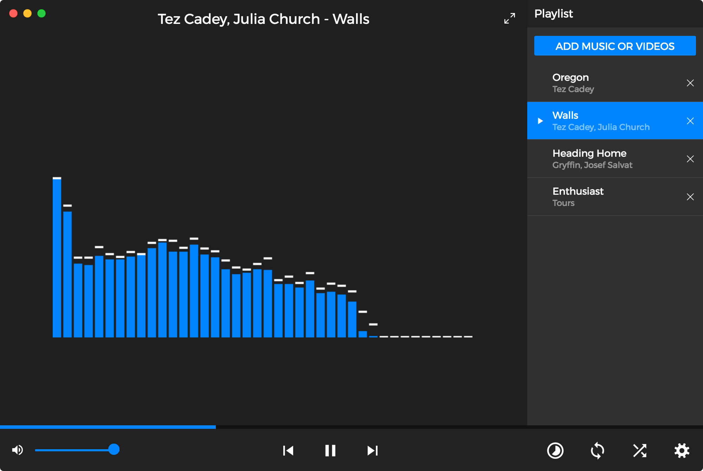
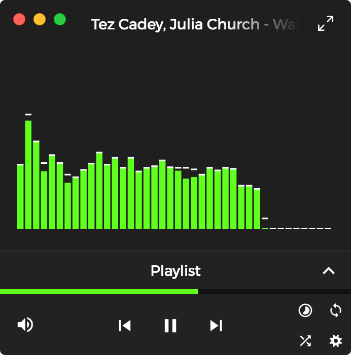
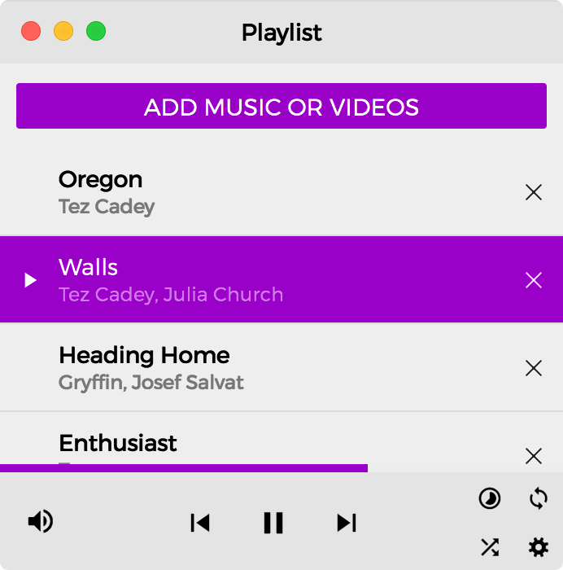
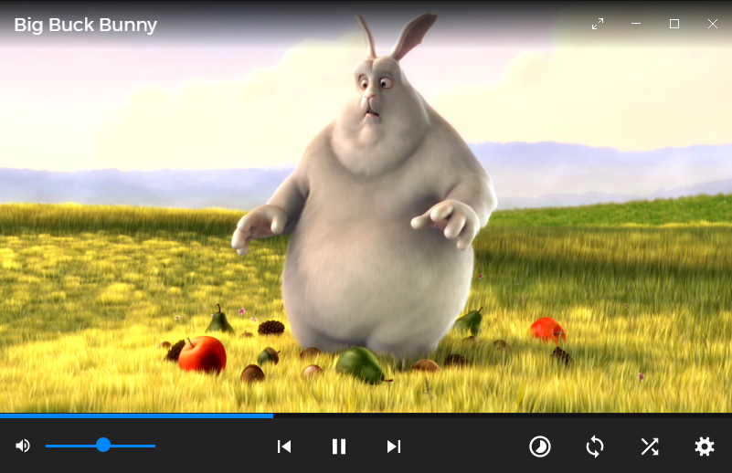

# Media player











## Authors
- Maintainers: Mohamed Hadjoudj (@MohIceAge), Tim Nguyen (@nt1m)
- Contributors: Daniell Mesquita (@Plasmmer)

## Compatibility
Tested on: Firefox and Chrome.

## Contributing
Pull requests ")

## Resources
- Audio visualizer (modified): [HTML5 Audio Visualizer](https://github.com/Wayou/HTML5_Audio_Visualizer)
- Icons: [Material Design Icons](https://github.com/google/material-design-icons)

## Technologies used
- Web Audio API (visualizer)
- HTML `<video>` tag
- CSS variables
- Canvas

# Build and Run From Source the standalone app
You'll need NodeJS, Npm and optionally git.

### Install the Prerequisites
Download the project (by downloading the zipped project or by typing `git clone https://github.com/nt1m/media-player`)
then run the following command in the root directory.
```
npm i
```

### Run the app

If nothing fails then you can run the app by typing:
```
npm start
```

### Bundling the app:

The bundles will appear in `dist/`.

* Current platform only: `npm run pack`
* Windows (both 32-bit and 64-bit): `npm run pack-win`
* macOS 64-bit: `npm run pack-osx`
* Linux (both 32-bit and 64-bit): `npm run pack-linux`
* For all 3 platforms: `npm run pack-all`
